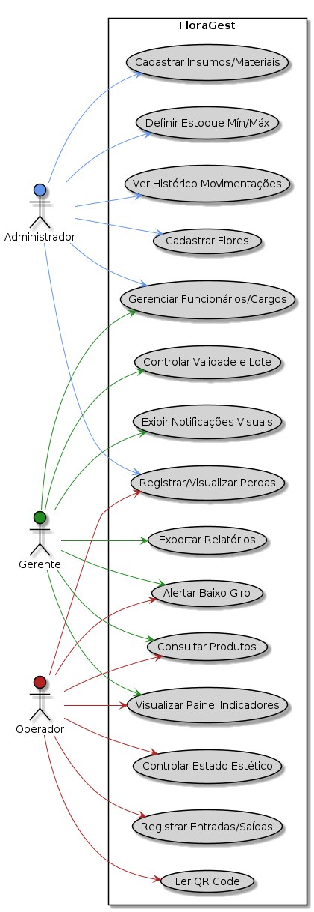

# Visão de Casos de Uso (Escopo do Produto)

O sistema **FloraGest**, desenvolvido para atender pequenas e médias floriculturas, visa modernizar e automatizar a gestão de estoque de flores, promovendo maior controle, eficiência e redução de perdas. O foco do produto é oferecer uma interface acessível e intuitiva para registrar, monitorar e analisar o estoque, com alertas inteligentes, relatórios analíticos e dashboard.

O escopo funcional do produto, que foi detalhado no **Backlog do Produto** (Seção 4.4 do Documento de Visão), contém as funcionalidades essenciais (**Must**), importantes (**Should**) e desejáveis (**Could**), e descreve os perfis de acesso, com permissões de acesso e responsabilidades claras.

A partir das principais funcionalidades descritas no escopo — como:

- Cadastro de flores  
- Registro de entradas e saídas de estoque  
- Controle de validade e lote  
- Definição de estoque mínimo e máximo  
- Consulta rápida de produtos  
- Alertas de produtos com baixo giro  

e dos perfis de acesso (**Administrador**, **Gerente** e **Operador**), foi definido o **Diagrama de Casos de Uso** abaixo, que ilustra a interação entre esses atores e as principais funcionalidades.

  

  
<strong>Figura</strong> – Diagrama de Casos de Uso – FloraGest 
  <strong>Fonte</strong>: Elaboração Própria (2025)

---

## Papéis e Responsabilidades

- **Administrador**:  
  Responsável pelo cadastro de flores e insumos, controle de estoque mínimo/máximo, gerenciamento de funcionários e análise de movimentações.

- **Gerente**:  
  Acompanha os dados por meio de gráficos, relatórios, alertas e dashboards, apoiando decisões estratégicas.

- **Operador**:  
  Realiza registros operacionais de movimentações, controle estético, leitura de QR Code e relatórios de perda.

---

## Justificativa Arquitetural

A escolha do estilo arquitetural foi influenciada pela **natureza perecível dos produtos (flores)** e pela necessidade de controle de **entradas, saídas e validade**. Além disso, a demanda por **automação**, **facilidade de uso** e **monitoramento em tempo real** levou à escolha de uma arquitetura que suporte:

- Alta responsividade  
- Manipulação eficiente de dados  

A experiência da equipe com as tecnologias:

- **React** (Frontend)  
- **Python** e **FastAPI** (Backend)  
- **MySQL** (Banco de Dados)  

também influenciou essa decisão, direcionando para uma **arquitetura em camadas**, que facilita:

- Integração  
- Escalabilidade  
- Desenvolvimento incremental  
- Integração contínua  
- Manutenção e evolução  

seguindo a **metodologia ScrumXP** adotada pela equipe.