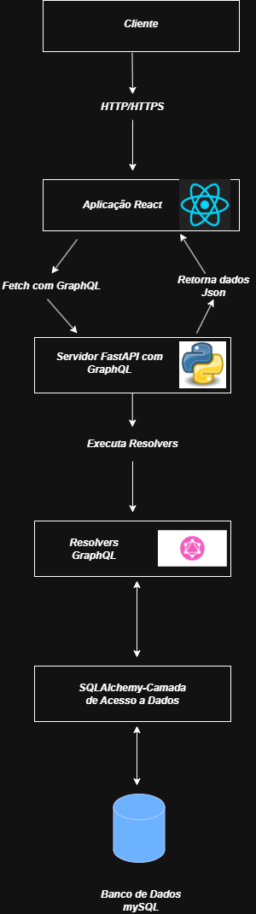

## Diagrama de componentes

  

  
<strong>Figura</strong> – Diagrama de componentes – FloraGest 
  <strong>Fonte</strong>: Elaboração Própria (2025)

---

## Arquitetura da Aplicação GraphQL com React, FastAPI e MySQL

O diagrama ilustra o fluxo de dados em uma aplicação que utiliza GraphQL, React, FastAPI e MySQL. Um cliente inicia uma requisição via HTTP/HTTPS, que é capturada pela aplicação React. Esta, por sua vez, formula e envia uma consulta GraphQL para o servidor. O servidor, construído com FastAPI e GraphQL, recebe essa consulta e a direciona para os Resolvers GraphQL. Os Resolvers são a camada responsável por implementar a lógica de busca dos dados solicitados. Para acessar os dados, os Resolvers interagem com a camada de acesso a dados SQLAlchemy, que estabelece a comunicação com o banco de dados MySQL. Os dados são então recuperados do MySQL, processados pelos Resolvers e retornados ao servidor FastAPI com GraphQL. O servidor formata esses dados em JSON e os envia de volta para a aplicação React, que finalmente os utiliza para renderizar ou atualizar a interface do usuário para o cliente. Em essência, o diagrama detalha a arquitetura onde o frontend React solicita dados de maneira flexível através de GraphQL a um backend Python (FastAPI), que orquestra a busca e recuperação dessas informações de um banco de dados MySQL utilizando SQLAlchemy.