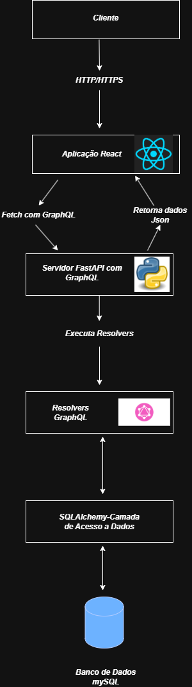

## Diagrama de componentes

O diagrama de componentes a seguir apresenta uma visão estrutural dos principais módulos e tecnologias envolvidos na arquitetura do FloraGest. Ele ilustra como os elementos da aplicação — frontend, backend, API GraphQL, camada de persistência e banco de dados — se relacionam entre si, compondo uma arquitetura modular e escalável. Essa representação facilita o entendimento da organização geral do sistema e de como os dados fluem entre os diferentes componentes durante a execução das funcionalidades.

**Figura: Diagrama de componentes do FloraGest**

**Fonte:** Elaboração Própria (2025)

---

## Arquitetura da Aplicação GraphQL com React, FastAPI e MySQL

O diagrama ilustra o fluxo de dados em uma aplicação que utiliza GraphQL, React, FastAPI e MySQL. Um cliente inicia uma requisição via HTTP/HTTPS, que é capturada pela aplicação React. Esta, por sua vez, formula e envia uma consulta GraphQL para o servidor. O servidor, construído com FastAPI e GraphQL, recebe essa consulta e a direciona para os Resolvers GraphQL. Os Resolvers são a camada responsável por implementar a lógica de busca dos dados solicitados. Para acessar os dados, os Resolvers interagem com a camada de acesso a dados SQLAlchemy, que estabelece a comunicação com o banco de dados MySQL. Os dados são então recuperados do MySQL, processados pelos Resolvers e retornados ao servidor FastAPI com GraphQL. O servidor formata esses dados em JSON e os envia de volta para a aplicação React, que finalmente os utiliza para renderizar ou atualizar a interface do usuário para o cliente. Em essência, o diagrama detalha a arquitetura onde o frontend React solicita dados de maneira flexível através de GraphQL a um backend Python (FastAPI), que orquestra a busca e recuperação dessas informações de um banco de dados MySQL utilizando SQLAlchemy.
