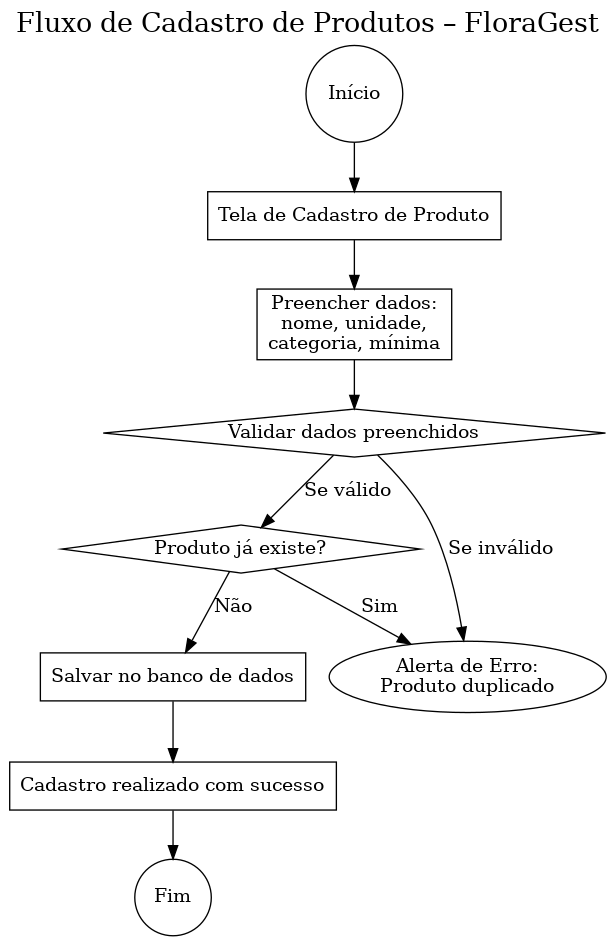
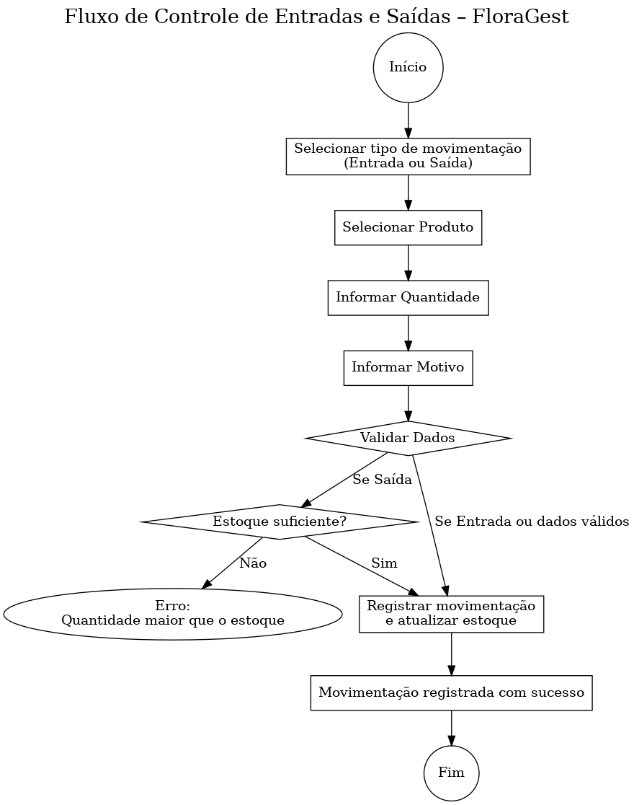
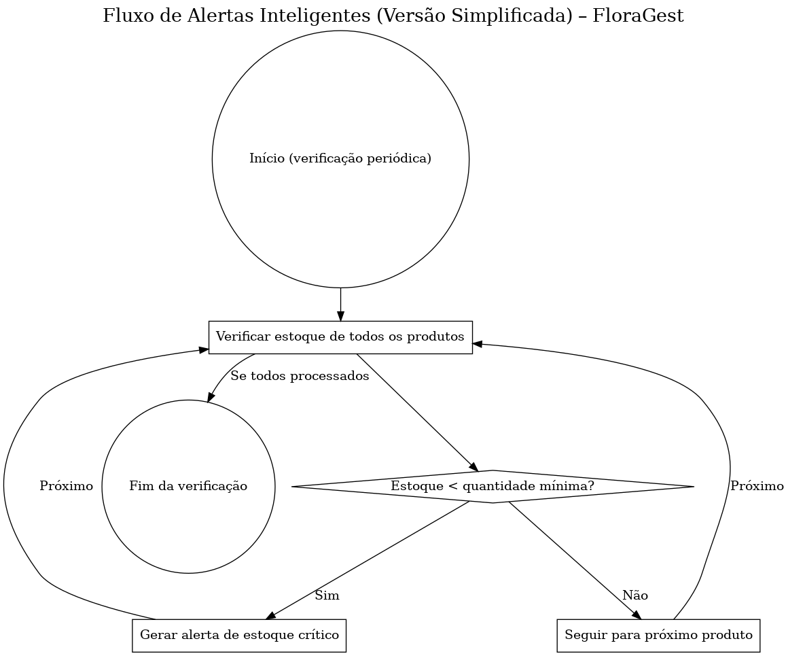
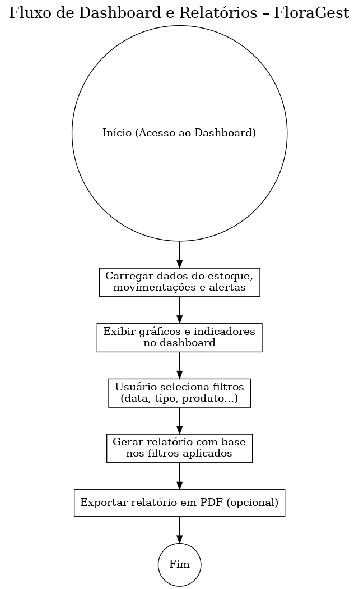
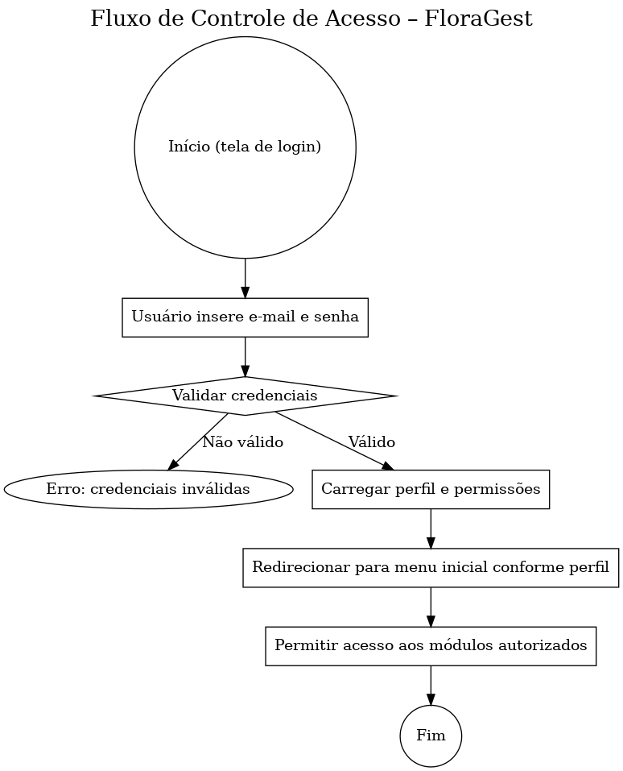
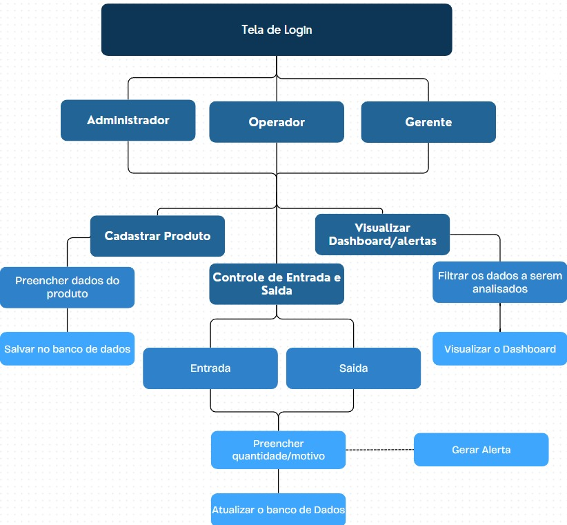
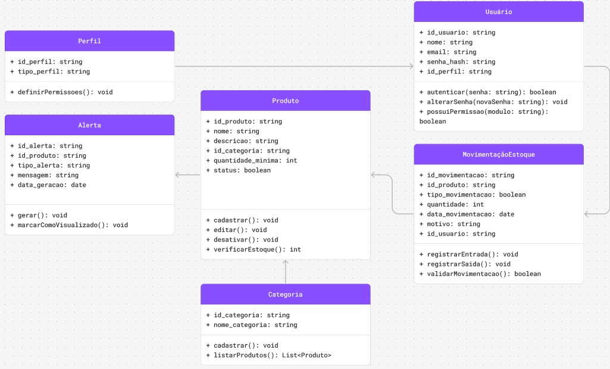

# Visão Lógica

A visão lógica descreve a estrutura interna do sistema, organizando os módulos, entidades e fluxos de dados que o compõem. Ela representa como os componentes do software interagem entre si para garantir o funcionamento correto e eficiente da aplicação.
No contexto do FloraGest, a visão lógica detalha como funcionalidades como cadastro de produtos, controle de movimentações, geração de alertas e visualização de relatórios se conectam logicamente. Essa visão permite mapear o comportamento do sistema, facilitando tanto o desenvolvimento quanto a manutenção da solução.
O nosso sistema é subdividido em 5 módulos principais, sendo eles:

 

## Cadastro de Produtos

O módulo Cadastro de Produtos é responsável por armazenar e organizar as informações dos itens que compõem o estoque da floricultura, como flores, vasos, adubos, embalagens e demais insumos. Ele é a base para os demais módulos operarem corretamente, pois todas as movimentações de estoque (entrada, saída, alerta) dependem dos dados cadastrados aqui.

**Figura:** Fluxo de Cadastro de Produto - FloraGest - Elaboração Própria (2025)

### Como funciona:

- Ao cadastrar um novo produto, o usuário informa seu nome, categoria, unidade e quantidade mínima.
- O sistema valida se já existe um produto com o mesmo nome e categoria.
- Toda vez que um produto é usado em uma movimentação de entrada ou saída, os dados deste módulo são utilizados como referência.

---

## Controle de Entrada e Saída

O módulo Controle de Entradas e Saídas é responsável por registrar todas as movimentações que alteram a quantidade de produtos no estoque. Isso inclui:

- Entradas (compra, recebimento de fornecedor, reposição interna);
- Saídas (venda, descarte, doação, perda, vencimento).

**Figura:** Fluxo de Controle de Entrada e Saída - FloraGest - Elaboração Própria (2025)

### Como funciona:

- O usuário acessa o módulo e escolhe se vai registrar uma entrada ou saída.
- Seleciona o produto e informa a quantidade.
- É exigido um motivo para qualquer movimentação (obrigatório).
- A aplicação registra a movimentação no banco e atualiza automaticamente o estoque do produto envolvido.
- A movimentação pode ser consultada no histórico ou filtrada por data, tipo, produto ou usuário.

---

## Alertas e Notificações

O módulo Alertas Inteligentes é responsável por monitorar continuamente o estoque de produtos e identificar situações críticas que exigem ação do gestor. Ele gera notificações automáticas com base em regras de negócio predefinidas e comportamento do estoque, como:

- Produtos abaixo da quantidade mínima cadastrada
- Produtos sem movimentação por muito tempo
- Produtos próximos da validade (opcional)
- Redução abrupta de estoque em curto período

**Figura:** Fluxo de Alerta - FloraGest - Elaboração Própria (2025)

### Como funciona:

- O sistema executa rotinas automáticas (cron jobs ou triggers) que varrem o estoque periodicamente.
- Ao detectar um produto abaixo do nível mínimo, um novo alerta é criado.
- Os alertas são exibidos na tela inicial (dashboard) e podem ser filtrados por tipo, produto ou data.
- O usuário pode marcar um alerta como "visualizado", mas ele permanece salvo para histórico e auditoria.

---

## Dashboards

O módulo Dashboard e Relatórios tem como finalidade apresentar visualmente os dados operacionais do sistema, possibilitando que o(a) gestor(a) da floricultura tome decisões com base em indicadores reais. Ele consolida informações de outros módulos (Produtos, Movimentações, Alertas) em gráficos, tabelas e relatórios filtráveis.

### A principal funcionalidade é gerar Dashboard:

- Gráficos de barras, pizza ou linha com:
  - Entradas e saídas por período
  - Produtos mais movimentados
  - Produtos com menor estoque
  - Histórico de movimentações
  - Indicadores de estoque crítico

 
**Figura:** Fluxo de Dashboard - FloraGest - Elaboração Própria (2025)

### Como funciona:

- O sistema coleta os dados automaticamente dos módulos já alimentados.
- O usuário pode aplicar filtros para gerar visualizações e relatórios customizados.
- O dashboard é carregado ao acessar o sistema e atualizado automaticamente (ou via botão “Atualizar”).

---

## Controle de Acesso

O módulo Controle de Acesso é responsável por gerenciar a autenticação (login) e a autorização (nível de permissão) dos usuários do sistema FloraGest. Ele garante que cada usuário acesse apenas as funcionalidades que são pertinentes à sua função, assegurando a integridade e segurança das operações e dados.

**Figura:** Fluxo de Controle de Acesso - FloraGest - Elaboração Própria (2025)

### Como funciona:

- O usuário realiza o login com e-mail e senha.
- O sistema valida a senha criptografada.
- Após login, o sistema carrega o perfil do usuário e verifica suas permissões para cada ação ou módulo.
- Os menus e botões da interface se adaptam às permissões do usuário logado.

---

## Diagramas Complementares

**Figura:** Diagrama de Atividades - FloraGest - Elaboração Própria (2025)

**Figura:** Diagrama de Classes - FloraGest - Elaboração Própria (2025)
