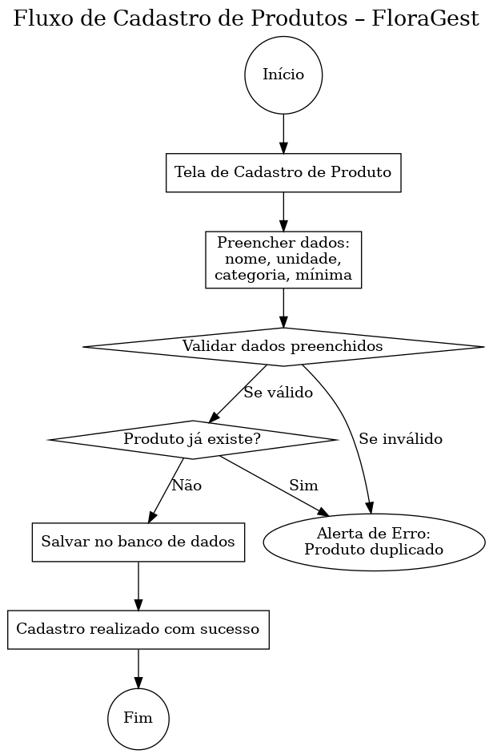
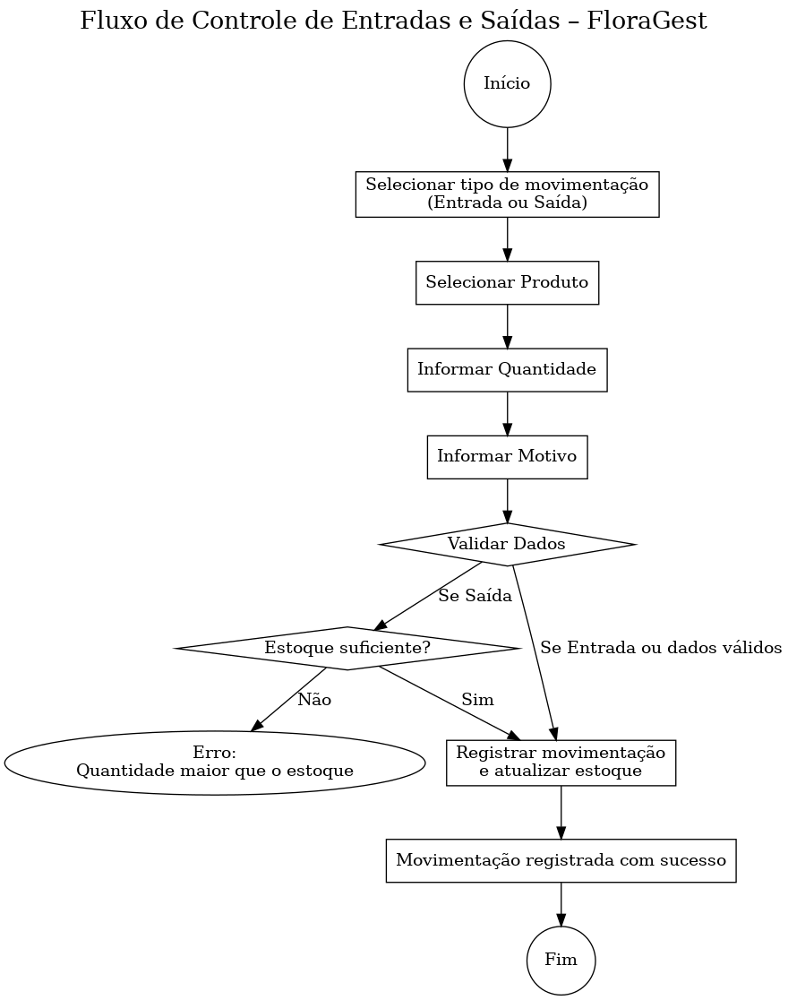
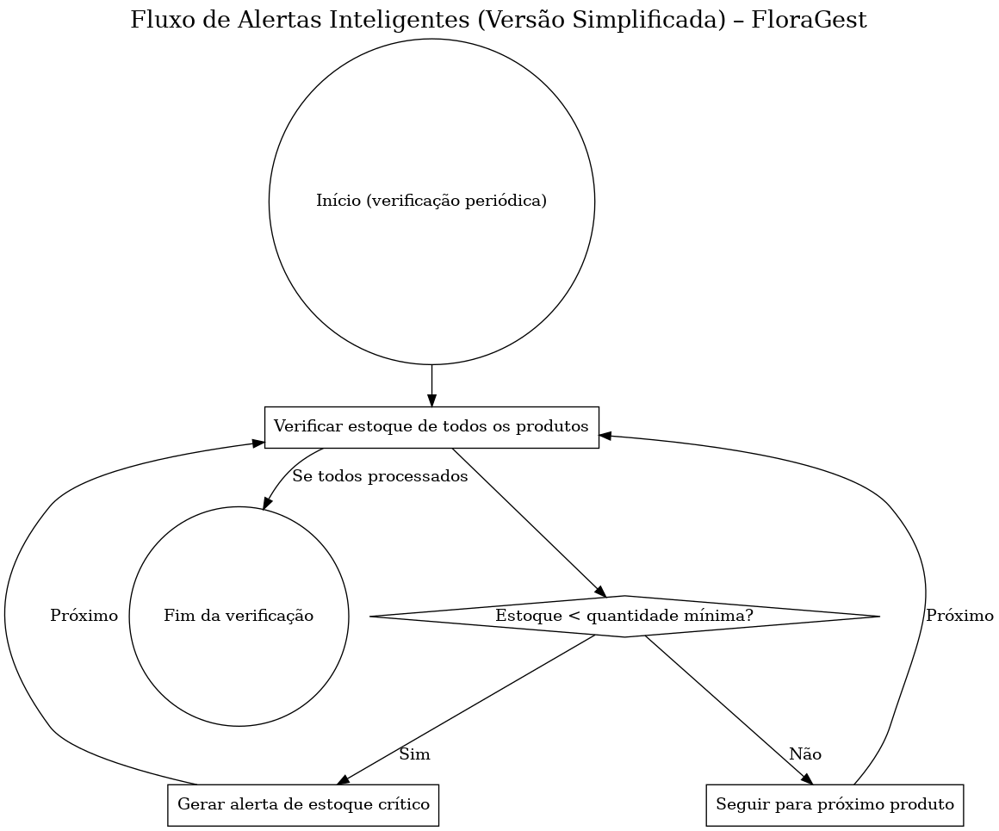
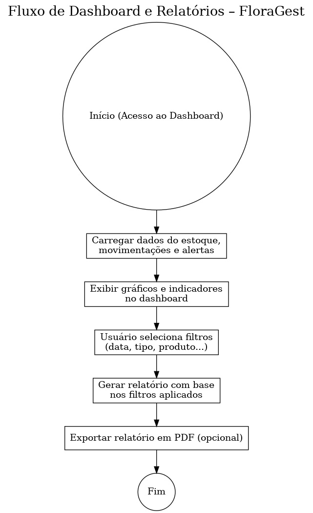
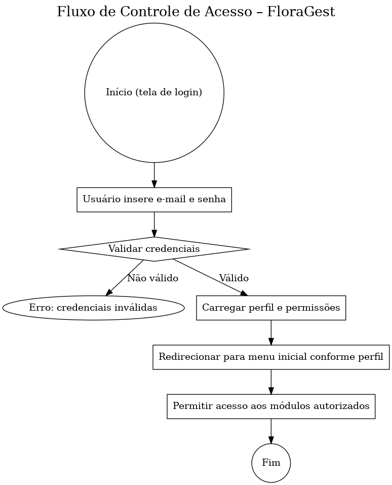
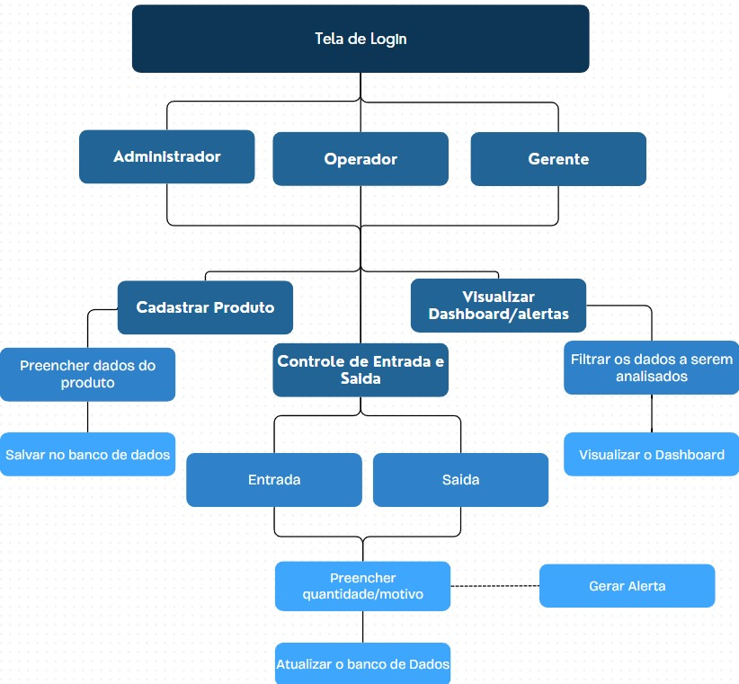
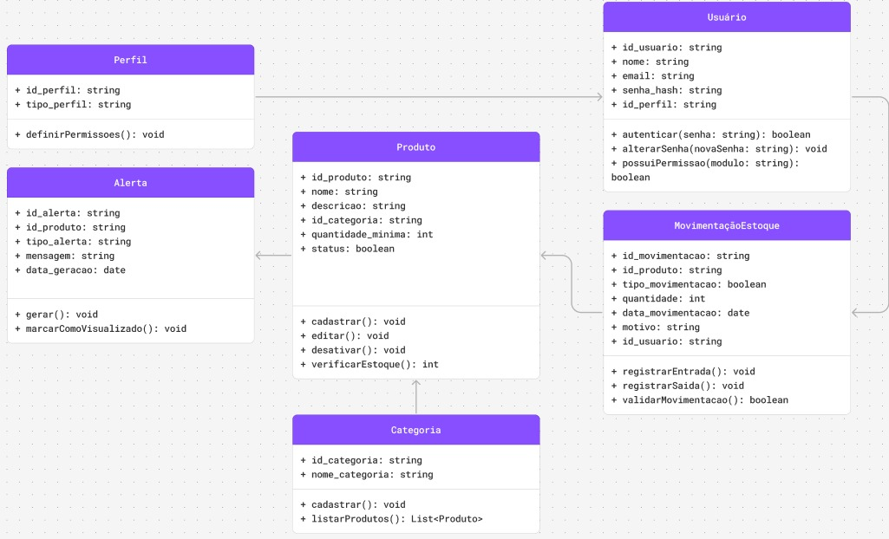

# Visão Lógica

A visão lógica descreve a estrutura interna do sistema, organizando os módulos, entidades e fluxos de dados que o compõem. Ela representa como os componentes do software interagem entre si para garantir o funcionamento correto e eficiente da aplicação.
No contexto do FloraGest, a visão lógica detalha como funcionalidades como cadastro de produtos, controle de movimentações, geração de alertas e visualização de relatórios se conectam logicamente. Essa visão permite mapear o comportamento do sistema, facilitando tanto o desenvolvimento quanto a manutenção da solução.
O nosso sistema é subdividido em 5 módulos principais, sendo eles:

## Cadastro de Produtos

O módulo Cadastro de Produtos é responsável por armazenar e organizar as informações dos itens que compõem o estoque da floricultura, como flores, vasos, adubos, embalagens e demais insumos. Ele é a base para os demais módulos operarem corretamente, pois todas as movimentações de estoque (entrada, saída, alerta) dependem dos dados cadastrados aqui. 

O diagrama a seguir complementa a descrição técnica do módulo, ilustrando um fluxo de usuário real durante o processo de cadastro de um novo produto no sistema. Ele apresenta as etapas percorridas por um administrador ao registrar flores ou insumos no estoque da floricultura.

**Figura:** Fluxo de Cadastro de Produto - FloraGest

 
 **Fonte:** Elaboração Própria (2025)

### Como funciona:

- Ao cadastrar um novo produto, o usuário informa seu nome, categoria, unidade e quantidade mínima.
- O sistema valida se já existe um produto com o mesmo nome e categoria.
- Toda vez que um produto é usado em uma movimentação de entrada ou saída, os dados deste módulo são utilizados como referência.

### Fluxo do usuário:

Maria, administradora da floricultura, acessa o sistema com seu login. No menu, ela seleciona “Cadastro de Produtos” e clica em “Novo Produto”. Preenche os campos:

- Nome: **Rosa Vermelha**
- Categoria: **Flor**
- Unidade: **Unidade**
- Quantidade mínima: **20**

O sistema verifica se já existe esse produto e, não encontrando duplicatas, confirma o cadastro com uma mensagem de sucesso. Maria vê o novo produto listado na tabela abaixo do formulário.

---

## Controle de Entrada e Saída

O módulo Controle de Entradas e Saídas é responsável por registrar todas as movimentações que alteram a quantidade de produtos no estoque. Isso inclui:

- Entradas (compra, recebimento de fornecedor, reposição interna);
- Saídas (venda, descarte, doação, perda, vencimento).

O diagrama abaixo demonstra um fluxo de uso prático no módulo de movimentações de estoque. Representa como um operador registra entradas e saídas de produtos, garantindo a atualização em tempo real da quantidade em estoque e o registro das justificativas associadas.

**Figura:** Fluxo de Controle de Entrada e Saída - FloraGest

**Fonte:** Elaboração Própria (2025)

### Como funciona:

- O usuário acessa o módulo e escolhe se vai registrar uma entrada ou saída.
- Seleciona o produto e informa a quantidade.
- É exigido um motivo para qualquer movimentação (obrigatório).
- A aplicação registra a movimentação no banco e atualiza automaticamente o estoque do produto envolvido.
- A movimentação pode ser consultada no histórico ou filtrada por data, tipo, produto ou usuário.

### Fluxo do usuário:

João, operador da loja, acaba de receber uma entrega de flores. Ele acessa o sistema, vai até “Movimentações” e clica em “Registrar Entrada”. Seleciona o produto **“Lírio Branco”**, informa:

- Quantidade: **30 unidades**
- Motivo: **Reposição de estoque**

Após confirmar, o sistema atualiza o estoque automaticamente.

Mais tarde, ao vender flores, João repete o processo em “Registrar Saída”, registrando o motivo como **Venda**.

---

## Alertas e Notificações

O módulo Alertas Inteligentes é responsável por monitorar continuamente o estoque de produtos e identificar situações críticas que exigem ação do gestor. Ele gera notificações automáticas com base em regras de negócio predefinidas e comportamento do estoque, como:

- Produtos abaixo da quantidade mínima cadastrada
- Produtos sem movimentação por muito tempo
- Produtos próximos da validade (opcional)
- Redução abrupta de estoque em curto período

A seguir, o diagrama mostra como o sistema identifica automaticamente situações críticas no estoque (como baixa quantidade, proximidade da validade ou produtos parados) e notifica os usuários responsáveis. O fluxo exemplifica o uso dessa funcionalidade por um gerente no dia a dia.

**Figura:** Fluxo de Alerta - FloraGest

**Fonte:** Elaboração Própria (2025)

### Como funciona:

- O sistema executa rotinas automáticas (cron jobs ou triggers) que varrem o estoque periodicamente.
- Ao detectar um produto abaixo do nível mínimo, um novo alerta é criado.
- Os alertas são exibidos na tela inicial (dashboard) e podem ser filtrados por tipo, produto ou data.
- O usuário pode marcar um alerta como "visualizado", mas ele permanece salvo para histórico e auditoria.

### Fluxo do usuário:

Ana, gerente da floricultura, acessa o sistema e observa um alerta no dashboard:

> ⚠️ Estoque crítico: Orquídea Branca com apenas 4 unidades (mínimo: 10)

Ela clica no alerta, visualiza os detalhes e agenda uma reposição.

Outro alerta indica:

> ⚠️ Produto vencendo: Rosa Amarela com validade para amanhã

Ana toma a decisão de montar um arranjo promocional para evitar perdas.

---

## Dashboards

O módulo Dashboard e Relatórios tem como finalidade apresentar visualmente os dados operacionais do sistema, possibilitando que o(a) gestor(a) da floricultura tome decisões com base em indicadores reais. Ele consolida informações de outros módulos (Produtos, Movimentações, Alertas) em gráficos, tabelas e relatórios filtráveis.

### A principal funcionalidade é gerar Dashboard:

- Gráficos de barras, pizza ou linha com:
  - Entradas e saídas por período
  - Produtos mais movimentados
  - Produtos com menor estoque
  - Histórico de movimentações
  - Indicadores de estoque crítico

O próximo diagrama representa um cenário de uso em que o gestor da floricultura acessa dashboards e relatórios analíticos para embasar decisões estratégicas. Ele mostra como os dados são consolidados e apresentados por meio de gráficos e filtros interativos.

**Figura:** Fluxo de Dashboard - FloraGest

**Fonte:** Elaboração Própria (2025)

### Como funciona:

- O sistema coleta os dados automaticamente dos módulos já alimentados.
- O usuário pode aplicar filtros para gerar visualizações e relatórios customizados.
- O dashboard é carregado ao acessar o sistema e atualizado automaticamente (ou via botão “Atualizar”).

### Fluxo do usuário:

Ao iniciar o expediente, Pedro (gerente) acessa o sistema e visualiza o **Dashboard**.

Ele aplica o filtro **“Últimos 7 dias”** e observa que os produtos com maior saída foram:

- **Girassol**
- **Vaso Decorado**

Em outro gráfico, nota que o estoque de **Cravo Vermelho** está abaixo do ideal.

Pedro exporta o relatório de movimentações em PDF para apresentar à proprietária no final da semana.

---

## Controle de Acesso

O módulo Controle de Acesso é responsável por gerenciar a autenticação (login) e a autorização (nível de permissão) dos usuários do sistema FloraGest. Ele garante que cada usuário acesse apenas as funcionalidades que são pertinentes à sua função, assegurando a integridade e segurança das operações e dados. 

O diagrama abaixo ilustra o fluxo de autenticação e controle de permissões no sistema FloraGest. Ele evidencia como diferentes perfis de usuário (como Operador e Administrador) têm acessos distintos às funcionalidades do sistema, garantindo segurança e integridade das operações.

**Figura:** Fluxo de Controle de Acesso - FloraGest

**Fonte:** Elaboração Própria (2025)

### Como funciona:

- O usuário realiza o login com e-mail e senha.
- O sistema valida a senha criptografada.
- Após login, o sistema carrega o perfil do usuário e verifica suas permissões para cada ação ou módulo.
- Os menus e botões da interface se adaptam às permissões do usuário logado.

### Fluxo do usuário:

Roberta, funcionária recém-contratada, recebe seu login como **“Operadora”**. Ao entrar no sistema, visualiza apenas os menus:

- “Registrar Movimentação”
- “Consultar Estoque”

Ao tentar acessar “Cadastrar Produtos”, o sistema exibe:

> Acesso restrito. Solicite permissão ao Administrador.

Já o perfil de Lucas, **Administrador**, exibe todas as funcionalidades do sistema. O sistema também registra o horário de login e logout de cada usuário para fins de auditoria.

---

## Diagramas Complementares

O diagrama de atividades a seguir representa um fluxo de trabalho típico dentro do sistema FloraGest, conectando diversas ações realizadas pelos usuários nos módulos principais. Ele tem como objetivo ilustrar a sequência lógica de operações — como login, cadastro, movimentação de estoque e geração de relatórios — conforme ocorrem na prática. Esse diagrama contribui para visualizar o comportamento dinâmico do sistema diante de interações reais dos usuários.

**Figura:** Diagrama de Atividades - FloraGest

**Fonte:** Elaboração Própria (2025)

O diagrama de classes abaixo descreve a estrutura estática do sistema FloraGest, apresentando as principais entidades envolvidas, seus atributos e os relacionamentos entre elas. Ele foi elaborado com base nos fluxos de usuário descritos anteriormente, refletindo a organização dos dados e as dependências necessárias para suportar as funcionalidades do sistema, como cadastro de produtos, controle de estoque e geração de alertas.

**Figura:** Diagrama de Classes - FloraGest

**Fonte:** Elaboração Própria (2025)
