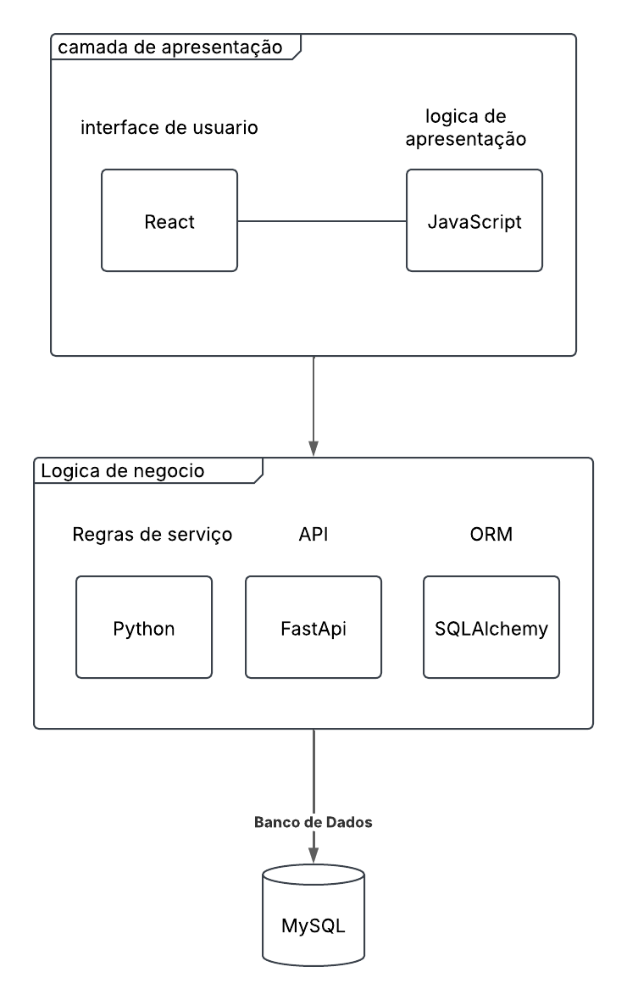

## Diagrama de Pacotes

  

  
<strong>Figura</strong> – Diagrama de Casos de Uso – FloraGest 
  <strong>Fonte</strong>: Elaboração Própria (2025)

---

O diagrama nos apresenta as principais camadas da arquitetura do **FloraGest**, sendo elas:

### 🔷 Camada de Apresentação
- Contém a **interface de usuário**, responsável pela interação do usuário com o sistema.
- Inclui também a **lógica de apresentação**, que capta e transforma os dados para o sistema.

### 🔷 Camada de Lógica de Negócio
- Abriga as **regras de serviço** que controlam e estipulam o funcionamento do sistema.
- Compreende também a **API** (FastAPI) e a **ORM** (SQLAlchemy), que fazem a mediação entre a apresentação e os dados.

### 🔷 Camada de Dados
- Responsável pelo **banco de dados** (MySQL), onde são armazenadas as informações do sistema.
