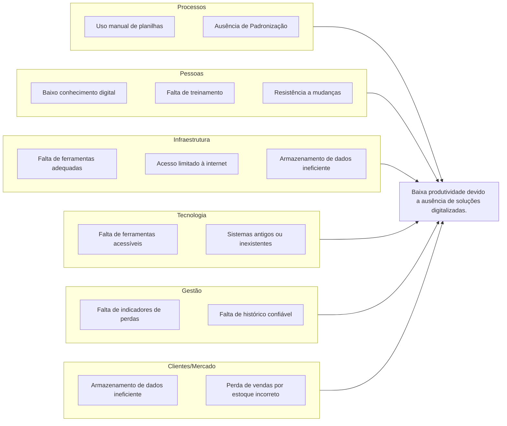

# Visão Geral do Produto

## Problema

### Contexto

A gestão de estoque é uma atividade essencial para o bom funcionamento de muitas empresas, especialmente as que lidam com produtos que têm uma vida útil.  Isso é uma realidade na agricultura e mais especificamente no ramo da floricultura, onde na manutenção de flores, por conta de sua natureza hiper perecível e precisarem manter sua boa aparência, exigem um controle ainda mais rigoroso de entrada, saída e validade que não teriam em outros setores da agricultura.

No entanto, muitas floriculturas, principalmente as de pequeno e médio porte, ainda utilizam planilhas ou controles manuais, o que gera desperdícios, rupturas no estoque e dificuldades na reposição, que devido ao tamanho do empreendimento, se tornam perdas ainda maiores. Neste contexto, o grupo propõe o desenvolvimento de uma plataforma de gestão de estoque especializada para empreendimentos do setor floriculturista, com foco em automação, facilidade de uso, monitoramento em tempo real, e gestão de volumes. A iniciativa surgiu após identificar essa lacuna pela análise de soluções de mercado, que justamente falham em cumprir esse nicho empresarial.

### Problema Identificado

Um florista começando seu negócio precisa pensar em como irá fazer o armazenamento e cuidado das flores, sendo essa uma parte chave do empreendimento. Porém, por falta de opções no mercado de aplicações que escalam com altos volumes de maneira organizada de uma floricultura e não apenas níveis domésticos de cuidado; que não facilitam o registro dessas flores para acomodar esse alto volume e para pessoas leigas em tecnologia; que não oferecem estatísticas e avisos com o fim de ajudar na gestão.

Dessa maneira, não existem alternativas no mercado que fazem o casamento de empresários e floristas que estão começando agora seu negócio e precisam de uma solução de gestão que acomodam quaisquer demandas usuários desse nicho poderiam ter, sem precisar depender de soluções mais ineficientes e com maior margem para erros como as manuais.

### Solução e Proposta

Desenvolver uma plataforma de gestão de estoque moderna, voltada para pequenos floristas que querem começar seu negócio ou médios empresários com  necessidade de manejar melhor sua organização de tamanho já considerável. A ferramenta será acessível, intuitiva e adaptada à realidade desses negócios, permitindo o registro e controle digital de entradas e saídas de produtos, alertas de estoque, análises de desempenho e suporte à tomada de decisão com base em dados, com o projeto sendo totalmente alinhado aos Objetivos de Desenvolvimento Sustentável (ODS) proposta pela ONU, de numero 8.2, além de um objetivo secundário de democratizar o uso de tecnologias para a população, que está prevista também como um dos objetivos da ODS.

!!! warning
    Substituir esse diagrama pelo Ishikawa, mas é necessário refazer a imagem com maior qualidade e com fundo coerente com
    o tema das docs!!!

## Declaração de Posição do Produto

| **Para:** | Pequenas, médias empresas do setor floriculturista. |
|---:|---|
| **Necessidade:** | Modernizar e automatizar a gestão de estoque e produção, reduzindo perdas e aumentando a produtividade. |
| **O (nome do produto):** | FloresCer-TE/FloreSer-TE/UnBuquê |
| **Que:** | Oferece uma interface simples para registrar, monitorar e analisar o estoque e movimentações, com alertas inteligentes e relatórios analíticos, como gráficos. |
| **Ao contrário:** | Uso de ferramentas eficientes, não escaláveis e geralmente lentas que geram problemas na gestão. |
| **Nosso produto:** | Foca na parte empreendedora do cuidado de flores, com várias ferramentas visuais e facilitadoras auxiliando esse propósito, sendo isso algo não existente em outros aplicativos do mercado voltados a esse setor. |

## Objetivos do Produto

### Objetivo Principal

Desenvolver uma plataforma digital de gestão de estoque voltada para floriculturas de pequeno e médio porte, com foco em acessibilidade, automação e eficiência, tirando limitações enfrentadas por esses empreendimentos, que muitas vezes recorrem a controles manuais ou planilhas ineficientes, resultando em perdas, rupturas de estoque e baixa previsibilidade, algo que é comum com o produto de natureza altamente perecível das flores e a exigência por manutenção estética constante , dessa forma, precisará de um controle rigoroso de entradas, saídas e validade dos produtos em tempo real.

A plataforma proporcionará, alertas inteligentes e relatórios analíticos, tudo isso com o objetivo de preencher uma lacuna no mercado, oferecendo uma solução especializada e escalável, adaptada às demandas reais do setor floriculturista, que também se alinha aos Objetivos de Desenvolvimento Sustentável (ODS) da ONU, especialmente o de número 8.2, promovendo a modernização de processos produtivos.

### Objetivos Secundários

- Promover a democratização no uso de ferramentas mais robustas para empreendedores de menor porte.
- Gerar relatórios e dashboards em tempo real para tomada de decisão;
- Controlar o estoque de outros recursos típicos de uma floricultura;

## Tecnologias a Serem Utilizadas

- **Frontend**: React  
- **Backend**: Python com Django  
- **Banco de Dados**: MySQL  
- **Frameworks/Bibliotecas**: React (frontend), Flask/Django (backend), GraphQL, qrcode 8.2  
- **Ferramentas adicionais**: GitHub, GitHub Pages e Actions, Figma (para prototipagem), Postman (testes de API), Docker (caso necessário para deploy), Google Docs, VsCode  
- **Hospedagem**: Heroku, Render ou plataforma similar
