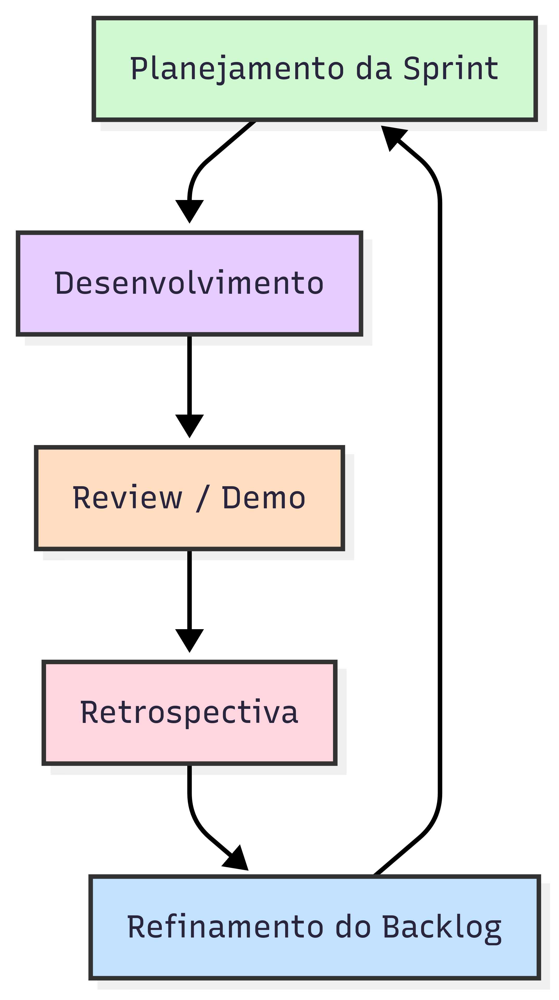

# Visão Geral do Projeto

## Ciclo de vida do projeto de desenvolvimento de software

O ciclo de vida de desenvolvimento adotado para o projeto **FloraGest** é baseado em um modelo **ágeil incremental híbrido**, combinando **Scrum** e **XP (ScrumXP)**. Isso permite entregas em **sprints semanais**, revisões frequentes, feedback constante e adaptação contínua.

A figura abaixo apresenta o fluxo geral, representando as fases principais: **Planejamento**, **Desenvolvimento**, **Revisão**, **Retrospectiva** e **Refinamento do Backlog**.

**Figura 1: Fluxo do Ciclo de Vida do FloraGest**

  

**Fonte:** Documento de Visão FloraGest – Elaborado pela equipe Jera (2025).

A tabela a seguir detalha cada fase do ciclo de vida do projeto, apresentando as principais atividades, os papéis envolvidos, as entradas e saídas esperadas, além das ferramentas e métodos utilizados para garantir o andamento do projeto de forma organizada e iterativa.

**Tabela 2: Fases do Ciclo de Vida**

| Fase | Atividades Principais | Pessoas | Entradas | Saídas | Ferramentas / Métodos |
|------|-----------------------|---------|----------|--------|-----------------------|
| Planejamento da Sprint | Definir metas, priorizar backlog | PO, Equipe | Backlog do Produto | Sprint Backlog | Figma, Teams, Gestão Contínua do Backlog |
| Desenvolvimento | Codificação, Testes, Pair Programming, Code Review | Equipe | Sprint Backlog | Incremento de Software | VS Code, GitHub, Postman, Render, Discord |
| Review / Demo | Demonstração, coleta de feedback | PO, Equipe, Stakeholders | Incremento de Software | Feedback | Teams, Discord |
| Retrospectiva | Lições aprendidas, melhorias | PO, Equipe | Feedback da Review | Ações de Melhoria | Teams |
| Refinamento do Backlog | Detalhar requisitos, priorizar backlog | PO, Equipe, Stakeholders | Feedback, Incremento de Software | Backlog Atualizado | Figma, Gestão Contínua do Backlog |

---
**Fonte:** Documento de Visão FloraGest – Elaborado pela equipe Jera (2025).

O **ScrumXP** foi escolhido por oferecer flexibilidade, adaptabilidade e ciclos curtos, fundamentais para equipes em formação, com pouca experiência em projetos colaborativos. O método favorece ajustes rápidos e acompanhamento contínuo do progresso.

As **daily meetings** ocorrem de forma informal, via **WhatsApp**, complementadas por reuniões formais no **Teams** e uso de **Discord** para pair programming e comunicação rápida durante o desenvolvimento.

---

## Organização do Projeto

A equipe se organiza em **duplas responsáveis**, conforme a tabela abaixo, garantindo colaboração cruzada e flexibilidade na alocação de tarefas.

**Tabela 3: Organização do Projeto**

| Papel | Atribuições | Responsável | Participantes |
|-------|--------------|--------------|----------------|
| Gerente/PO/Scrum Master | Organização do grupo e reuniões de sprints | João Gabriel | João Gabriel |
| APIs, Autenticação, Docker | Criar APIs, autenticação, organizar Docker, backlog | Lucas Andrade | Lucas Andrade, João Pedro |
| Backend e Testes | Infraestrutura de código, integração com banco, testes | Pablo Cunha | Pablo Cunha, Lucas Borges, Liander Medeiros |
| Front-end | Implementação das soluções visuais | Daniel Nunes | Daniel Nunes, Robson Junior |
| Arquitetura de Site | Decisões de navegação e layout | Bernardo Broetto | Bernardo Broetto, João Vitor |
| Banco de Dados (DER) | Estruturar o banco de dados | Brunno Fernandes | Brunno Fernandes, Rafaela Andrea |
| Modelagem de Banco e Consultas | Criação e hospedagem do banco, consultas SQL | Luis Zarbielli | Luis Zarbielli, Rafaela Andrea |
| Cliente (Monitor) | Representar o cliente da floricultura | Matheus Rodrigues | Matheus Rodrigues |

---
**Fonte:** Documento de Visão FloraGest – Elaborado pela equipe Jera (2025).

## Planejamento das Fases e/ou Iterações do Projeto

As sprints têm duração flexível, ajustadas de acordo com o calendário acadêmico. O acompanhamento ocorre preferencialmente às quartas ou sextas-feiras.

**Tabela 4: Sprints**

| Sprint | Produto (Entrega) | Data Início | Data Fim | Entregável | Responsáveis | % Conclusão |
|--------|--------------------|--------------|----------|-------------|---------------|--------------|
| Sprint 0 | Direcionamento geral | 11/04/2025 | 15/04/2025 | - | Todos | 5% |
| Sprint 1 | Documento de Visão (1.1 a 2.1) | 16/04/2025 | 22/04/2025 | Documento de Visão | João Gabriel | 15% |
| Sprint 2 | Início do Backlog | 23/04/2025 | 02/05/2025 | Parte do Backlog | João Pedro, Lucas Andrade | 25% |
| Sprint 3 | Conclusão do Backlog | 02/05/2025 | 09/05/2025 | Parte do Backlog | João Gabriel, Robson | 35% |
| Sprint 4 | Revisões e ajustes no Backlog | 12/05/2025 | 16/05/2025 | Documento revisado | João Gabriel, João Pedro, Lucas Andrade | 45% |
| Sprint 5 | Finalização do Documento de Visão | 17/05/2025 | 21/05/2025 | Documento finalizado | Todos | 55% |
| Sprint 6 | Início do desenvolvimento | 22/05/2025 | 28/05/2025 | Documento de Arquitetura | Liander, Brunno, Daniel, João Vitor, Luiz, Pablo | 65% |
| Sprint 7 | Modelagem do Banco, Figma, Backend | 29/05/2025 | 04/06/2025 | Diagramas e códigos iniciais | Todos | 70% |
| Sprint 8 | Tabelas, consultas, funcionalidades Must | 05/06/2025 | 11/06/2025 | Funcionalidades Must | Todos | 75% |
| Sprint 9 | Continuidade e testes | 12/06/2025 | 18/06/2025 | Funcionalidades Must e testes | Todos | 80% |
| Sprint 10 | Funcionalidades adicionais e documentação | 19/06/2025 | 25/06/2025 | Funcionalidades e docs | Todos | 85% |
| Sprint 11 | Ajustes finais | 26/06/2025 | 02/07/2025 | Funcionalidades adicionais e docs | Todos | 90% |
| Sprint 12 | Finalização do sistema | 03/07/2025 | 09/07/2025 | Software pronto e testado | Todos | 100% |

---
**Fonte:** Documento de Visão FloraGest – Elaborado pela equipe Jera (2025).

## Matriz de Comunicação

A matriz de comunicação define responsabilidades, periodicidade e produtos gerados para garantir alinhamento entre todos os membros.

**Tabela 5: Matriz de Comunicação**

| Descrição | Área/Envolvidos | Periodicidade | Produtos Gerados |
|-----------|------------------|----------------|-------------------|
| Acompanhamento via WhatsApp | Subequipes por área | Diária | Lista de demandas e itens realizados |
| Organização das sprints | Equipe do Projeto | Semanal | Atas de reunião, relatórios de situação |
| Avaliação e feedback (Review/Retrospectiva) | Equipe, Monitor | Quinzenal | Atas de reunião, relatórios de situação |

---
**Fonte:** Documento de Visão FloraGest – Elaborado pela equipe Jera (2025).

## Gerenciamento de Riscos

O gerenciamento de riscos visa prever problemas e definir ações preventivas e corretivas. O grau de exposição é classificado considerando **probabilidade de ocorrência** e **impacto**.

**Tabela 6: Gerenciamento de Riscos**

| Risco | Grau de Exposição | Mitigação | Plano de Contingência |
|-------|-------------------|-----------|-----------------------|
| Alterações de escopo | Alto | Backlog atualizado, registro de mudanças | Repriorizar sprint para funcionalidades essenciais |
| Dificuldade técnica | Médio | Sessões de estudo, pair programming | Trocar tecnologias por alternativas conhecidas |
| Baixo engajamento | Médio | Responsabilidades claras, daily via WhatsApp | Redistribuir tarefas e reforçar comunicação |
| Falha de integração com banco | Alto | Testes de integração frequentes | Backups e dumps regulares |
| Bugs em funcionalidades críticas | Alto | Testes contínuos | Correção imediata e entrega funcional mínima |
| Falta de comunicação | Alto | Uso de canais oficiais, daily informal | Reuniões extras se necessário |
| Falha de usabilidade | Médio | Testes manuais focados na usabilidade | Ajustes de layout e navegação conforme feedback |
| Sobrecarga/cansaço | Médio | Sprints curtas, cronogramas realistas | Reduzir escopo e priorizar funcionalidades |

---
**Fonte:** Documento de Visão FloraGest – Elaborado pela equipe Jera (2025).

## Critérios de Replanejamento

Esta seção define quando o replanejamento das sprints é necessário, com foco na **priorização de funcionalidades Must**.

**Tabela 7: Critérios de Replanejamento**

| Risco | Critério de Replanejamento | Ação |
|-------|----------------------------|------|
| Atraso por mudanças de requisitos | Atraso superior a 1 sprint | Repriorizar backlog |
| Falta de comunicação | Sem resposta por mais de 2 dias úteis | Delegar tarefas ao par responsável |
| Conflitos de integração | Bloqueio de funcionalidades Must | Testes constantes e refatoração |
| Perda de dados na importação | Perda identificada | Refatorar fluxo de importação |
| Mudança significativa de escopo | Funcionalidade Must em risco | Replanejar Should/Could |

---
**Fonte:** Documento de Visão FloraGest – Elaborado pela equipe Jera (2025).