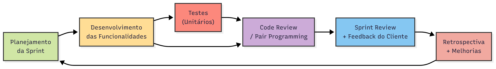

# Processo de Desenvolvimento de Software
Assim como foi esclarecido na seção 2.1 deste documento, serão usadas ferramentas de comunicação e métodos organizacionais que ajudarão na metodologia de desenvolvimento ScrumXP que se planeja utilizar. Abaixo, há o detalhamento de como será o desenvolvimento com o uso dessas ferramentas e de como será a interação com os métodos e as maneiras de comunicação.

## Principais Práticas Adotadas

* **Sprint Planning**: Definição dos objetivos da sprint, o que será desenvolvido e quem ficará responsável por cada tarefa.
* **Sprint Review e Retrospective**: Avaliação das entregas, feedback do cliente/monitor e discussão sobre melhorias no processo.
* **Pair Programming (XP)**: Programação em dupla para resolver problemas críticos ou desenvolver funcionalidades mais complexas, favorecendo o aprendizado e a redução de erros.
* **Code Review (XP)**: Revisão de código entre os membros para garantir padrões, qualidade e consistência.
* **Testes Contínuos (XP)**: Aplicação de testes unitários, de integração e manuais ao longo do desenvolvimento, garantindo qualidade no software entregue.
* **Gestão do Backlog**: O backlog é constantemente atualizado, refinado e priorizado com base nas necessidades do cliente e da equipe.

## Ferramentas de Suporte

* **Versionamento**: Git + GitHub
* **Documentação**: GitHub Pages + Google Docs
* **Prototipagem**: Figma
* **Comunicação**: Teams, Discord e WhatsApp
* **Testes**: Postman, Pytest, Teste manual
* **Deploy**: Render, Heroku ou AWS (a definir)

**Observação**: A equipe optou por não realizar reuniões diárias (Daily Scrum) de maneira formal, substituindo essa prática por uma comunicação constante via WhatsApp ou Discord e atualizações rápidas no próprio GitHub ou Teams.

A tabela a seguir apresenta os papéis definidos para a equipe do projeto, detalhando as principais atribuições de cada função, de forma a organizar responsabilidades e garantir o andamento das atividades conforme a metodologia adotada.

**Tabela 8: Descrição dos papéis**

| Papel               | Descrição                                                                                                    |
| :------------------ | :----------------------------------------------------------------------------------------------------------- |
| Scrum Master/PO     | Facilita as reuniões, organiza o backlog e intermedia a comunicação com o cliente.                            |
| Desenvolvedores Backend | Responsáveis pela construção da API, banco de dados, autenticação e testes backend.                          |
| Desenvolvedores Frontend | Implementam as telas, navegação e interação com a API.                                                       |
| Database Engineers  | Modelagem, criação e manutenção do banco de dados.                                                           |
| Cliente (Monitor)   | Valida as entregas, dá feedbacks e prioriza as demandas como cliente da floricultura.                        |

**Fonte:** Documento de Visão FloraGest – Elaborado pela equipe Jera (2025).

O diagrama a seguir representa o fluxo de trabalho do ciclo de vida do projeto, destacando as etapas de desenvolvimento, testes, revisões de código e feedback, assim como as iterações do processo, de acordo com o modelo ScrumXP adotado. Observa-se que atividades como Pair Programming e Code Review ocorrem em paralelo e ao final de cada ciclo, fortalecendo a qualidade e o aprendizado contínuo.

**Figura 2: Ciclo de Vida do projeto**

**Fonte:** Documento de Visão FloraGest – Elaborado pela equipe Jera (2025).
